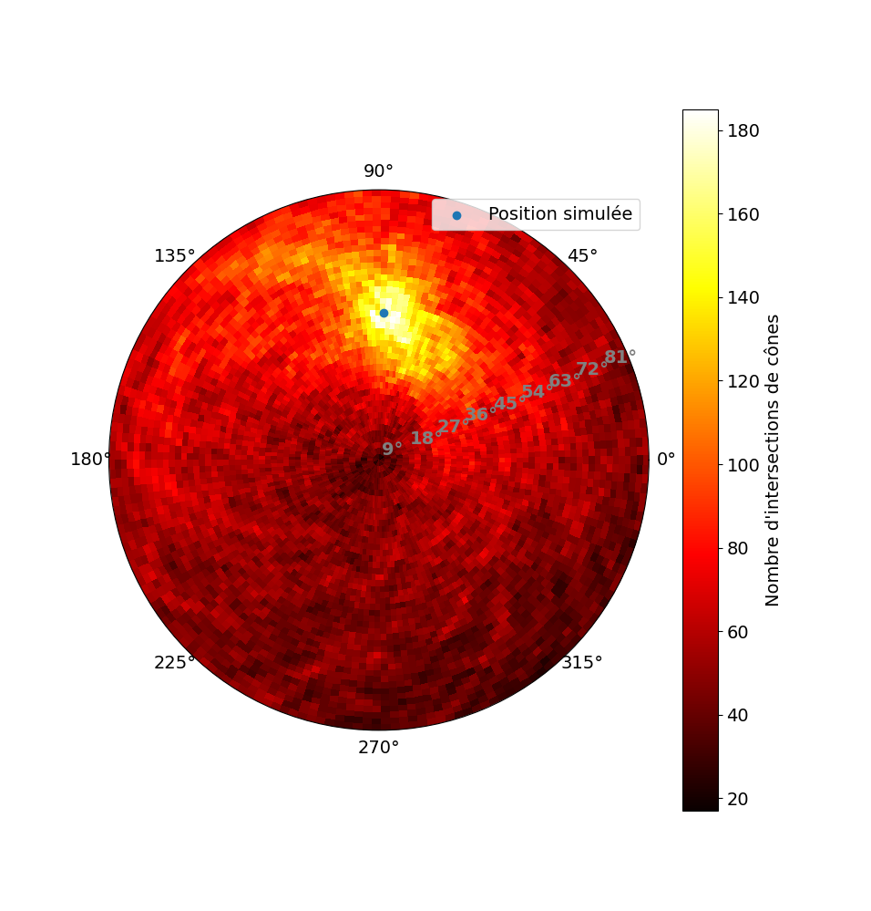

Scripts
=======

reconstruction_compton_density
------------------------------

Loads data from one of the `theta_<n>_phi_<m>.npy` files and plots a cone intersection density plot.
The script takes two optional integer parameter `theta` and `phi`.

To run the script move to a directory containing the data directory **save_Compton** and run : 

.. code-block:: console

    $ python deepcompton/scripts/reconstruction_compton_density

The expected output : 

